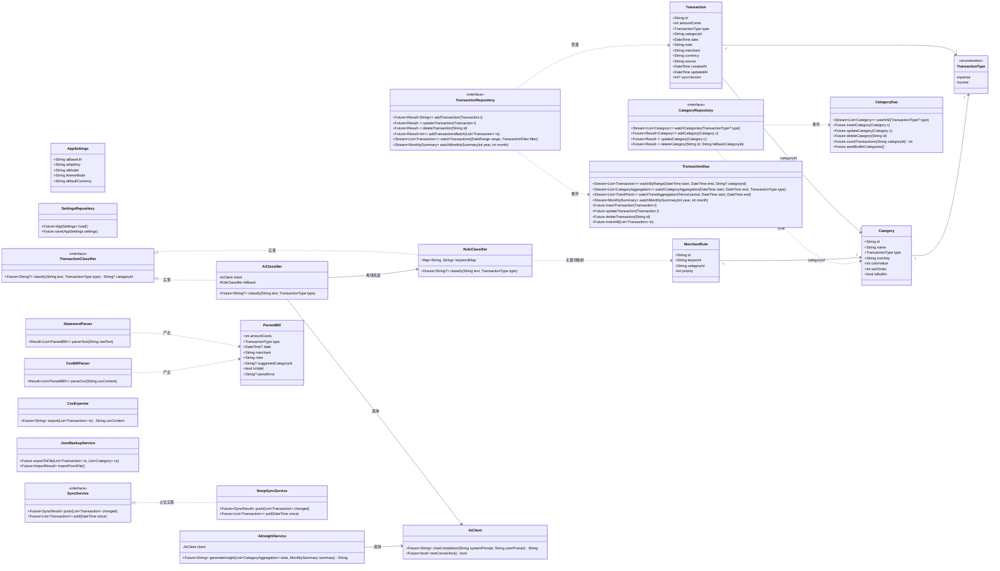
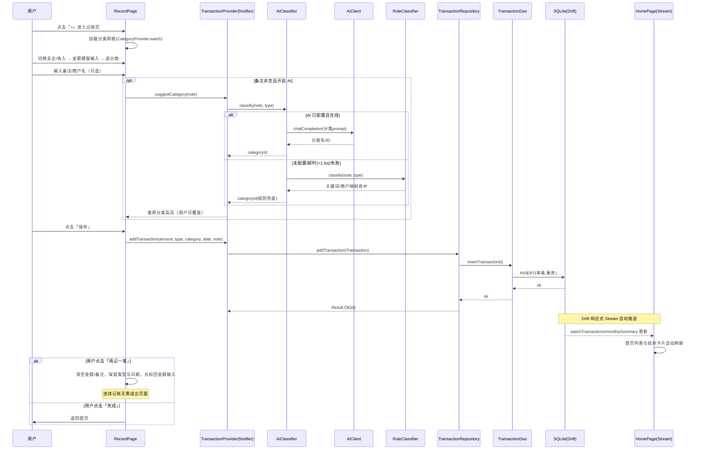
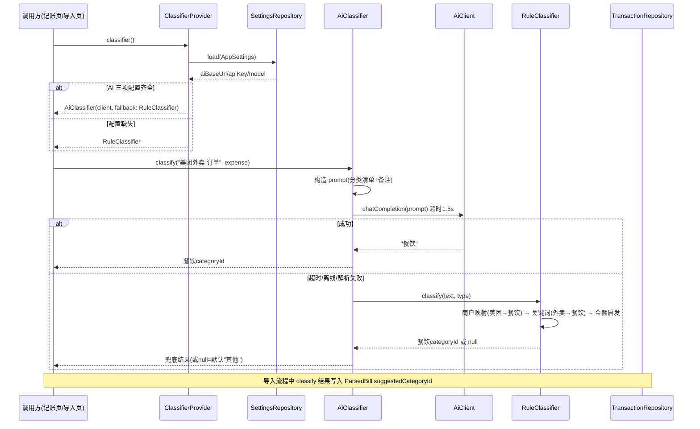
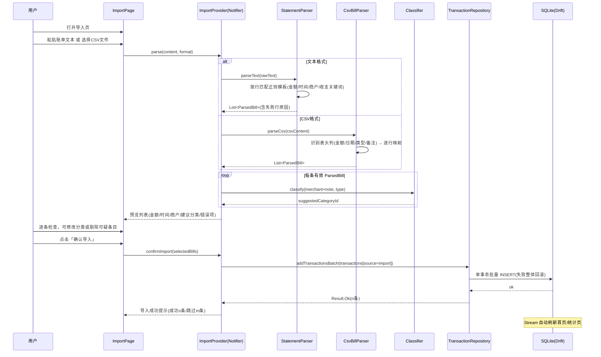
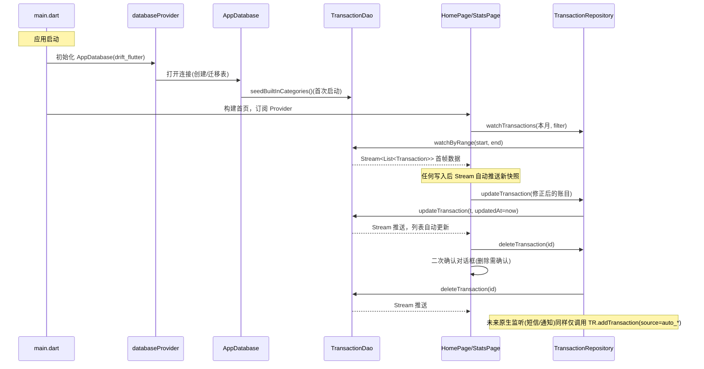
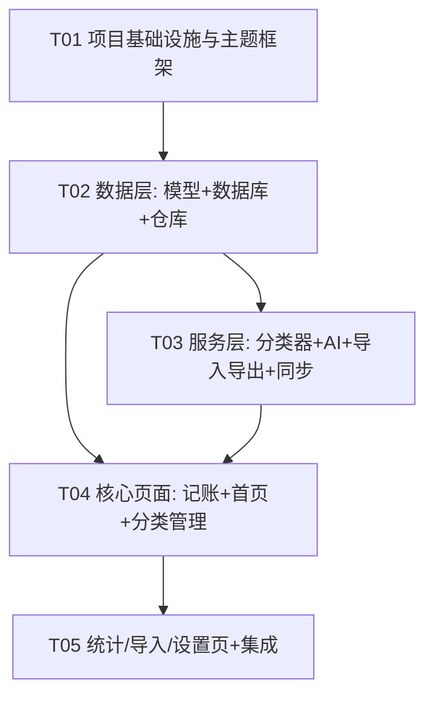

# 记账软件（ledger_app）— 系统架构设计文档

| 项目 | 内容 |
| --- | --- |
| 文档版本 | v1.0 |
| 角色 | 架构师（Gao） |
| 基于 | PRD v1.0 + 技术决策确认 + 补充需求 A/B/C/D |
| 技术栈 | Flutter (Dart)，一套代码覆盖 Android / iOS / Windows |

---

## Part A：系统设计

## 1. 实现方案与框架选型

### 1.1 核心技术挑战

1. **快速记账 ≤ 2 秒**：记账页需要极简交互路径（类型切换 → 金额键盘 → 分类网格 → 保存），保存后支持「再记一笔」连续记账，要求写入路径短、无阻塞。
2. **离线优先 + 可扩展云同步**：本地数据库是唯一数据源（Single Source of Truth），UI 通过响应式 Stream 自动刷新；云同步只做接口抽象，本期落地为「JSON 导出/导入 + 占位实现」。
3. **AI 智能分类的可用性降级**：AI 接口可能未配置/离线/超时，必须有规则分类器（关键词 + 商户映射）兜底，且两条路径对上层调用方透明。
4. **非结构化账单导入解析**：银行/支付短信、流水文本、CSV 格式各异，解析器需要多策略（正则模板 + CSV 结构化解析）+ 自动归类。
5. **统计聚合性能**：按分类/按时间的聚合查询应下推到数据库层（SQL GROUP BY），避免全量拉到内存计算。
6. **三端一致**（Android/iOS/Windows）：所有选型必须三端可用，避免平台原生强依赖。
7. **原生扩展点预留**：后续 Android 短信/通知监听自动记账，要求统一数据写入入口，不直接操作数据库。

### 1.2 框架与库选型（含理由）

| 领域 | 选型 | 理由 |
| --- | --- | --- |
| 本地存储 | **Drift (SQLite)** | ① 关系型 SQL 聚合（GROUP BY 按分类/月份统计）直接下推数据库，统计页性能好；② 编译期类型安全 + 响应式 Stream 查询，UI 自动刷新；③ 三端（Android/iOS/Windows）支持成熟（基于 sqlite3；Windows 桌面通过 `drift_flutter` + `sqlite3_flutter_libs` 直接可用）；④ 未来云同步需要按 `updatedAt` 做增量对比，SQL 查询能力远强于 Hive/Isar 的 NoSQL 模型；⑤ 迁移机制内建。Hive/Isar 虽写入更快，但聚合查询弱、Isar 桌面端支持一般，故不选。 |
| 状态管理 | **Riverpod (flutter_riverpod + riverpod_annotation 代码生成)** | ① 编译期安全（无 BuildContext 查找失败问题）；② Provider 天然就是轻量 DI 容器，无需额外引入 get_it；③ `StreamProvider` 与 Drift 的响应式查询无缝衔接；④ 状态可独立于 Widget 测试，便于 QA。相比 Provider：Provider 依赖 BuildContext、全局状态组织弱；相比 Bloc：样板代码多、对中型应用过重。 |
| 路由 | **go_router** | 声明式路由 + URL 映射 + 深度链接能力，为未来「通知点击跳转到记账页」预留；官方维护、三端可用。 |
| 图表 | **fl_chart** | 饼图/环形图、折线图、柱状图全覆盖，纯 Dart 实现三端一致，自定义样式能力强（满足清新可爱风格），社区活跃。 |
| 网络（AI） | **dio** | OpenAI 兼容接口（chat/completions）需要超时控制、重试、错误拦截；dio 拦截器与 CancelToken 成熟。 |
| CSV | **csv** | 标准 RFC 4180 解析，处理引号转义/中文编码稳健。 |
| 序列化 | **freezed + json_serializable** | 不可变数据模型 + union type（用于导入解析结果、AI 结果），减少手写样板。 |
| 本地键值 | **shared_preferences** | 存 AI 配置（BaseURL/ApiKey/模型名）、主题等轻量设置。 |
| UUID | **uuid** | 账目/分类主键用 UUID，为多端云同步合并预留（自增 ID 跨设备冲突）。 |
| 路径 | **path_provider + path** | JSON 导出/导入的文件路径（Windows 需拿到 Documents 目录）。 |
| 国际化 | **intl** | 日期格式化、金额格式化、图表轴标签。 |

### 1.3 架构模式

采用 **分层架构（Repository 模式）+ 响应式单向数据流**：

```
UI (features/*_page + widgets)
   │  仅消费 Provider，发起动作调用 Notifier/Service
   ▼
Providers (Riverpod)  ←—— 状态与 DI 编排层
   │
   ▼
Repositories (统一数据写入/读取入口，事务边界)
   │                          │
   ▼                          ▼
Drift DAO (SQL/Stream)     Services (AI / 规则 / 导入解析 / 同步)
   │
   ▼
SQLite 数据库 (本地唯一数据源)
```

关键原则：
- **UI 永不直接触达 DAO/数据库**；所有写入走 `TransactionRepository`（满足补充需求 D：原生短信/通知监听未来也只调 Repository）。
- **读 = Drift 响应式 Stream**：数据库变更自动推送 UI，无需手动刷新。
- **AI/规则分类统一抽象 `TransactionClassifier` 接口**，`AiClassifier` 与 `RuleClassifier` 可互换，上层不感知。

---

## 2. 文件列表（目录结构）

```
ledger_app/
├── pubspec.yaml                          # 依赖声明与版本策略
├── analysis_options.yaml                 # Dart 静态分析规则（启用 lints recommended）
├── README.md                             # 项目说明与构建指引
├── docs/
│   ├── PRD.md                            # 产品需求文档（已有）
│   └── ARCHITECTURE.md                   # 本文档
└── lib/
    ├── main.dart                         # 应用入口：初始化数据库/设置、挂载 ProviderScope
    ├── app.dart                          # MaterialApp 根组件：主题、路由配置、语言
    │
    ├── core/
    │   ├── constants/
    │   │   └── app_constants.dart        # 全局常量：默认分类种子数据、币种、正则模板、超时时间
    │   ├── theme/
    │   │   ├── app_theme.dart            # 清新可爱主题（浅色/深色 ThemeData 构建）
    │   │   └── color_tokens.dart         # 主题色 token（薄荷绿/奶油黄/樱花粉语义色定义）
    │   └── utils/
    │       ├── money_utils.dart          # 金额分↔元转换、格式化（¥1,234.56）、校验
    │       ├── date_utils.dart           # 月份起止、周/日区间、自然语言日期
    │       └── result.dart               # Result<T> 通用错误封装（Ok/Failure union）
    │
    ├── data/
    │   ├── local/
    │   │   ├── database.dart             # AppDatabase 定义（Drift）+ 迁移策略 + 连接初始化
    │   │   ├── tables.dart               # Drift 表定义：Transactions/Categories/MerchantRules
    │   │   ├── converters.dart           # Drift 类型转换器（枚举、DateTime↔epoch）
    │   │   └── daos/
    │   │       ├── transaction_dao.dart  # 账目 CRUD + Stream 查询 + 按分类/时间聚合 SQL
    │   │       └── category_dao.dart     # 分类 CRUD + Stream + 种子数据写入
    │   ├── models/
    │   │   ├── transaction.dart          # Transaction 不可变模型（freezed）：金额分/类型/分类/备注/币种
    │   │   ├── category.dart             # Category 模型：图标 key、颜色、类型、排序
    │   │   ├── merchant_rule.dart        # 商户→分类映射规则模型
    │   │   ├── app_settings.dart         # 设置模型：AI BaseURL/ApiKey/模型名、主题偏好
    │   │   └── enums.dart                # TransactionType(expense/income)、SyncStatus 枚举
    │   ├── repositories/
    │   │   ├── transaction_repository.dart  # ★统一写入入口：add/update/delete（事务+updatedAt）/自动归类钩子
    │   │   ├── category_repository.dart     # 分类增删改（删除时校验被引用、提示迁移）
    │   │   └── settings_repository.dart     # 设置读写（shared_preferences 封装）
    │   └── import_parse/
    │       ├── statement_parser.dart     # 非结构化文本解析（正则模板：金额/时间/商户提取）
    │       ├── csv_bill_parser.dart      # CSV 解析：表头字段映射（金额/时间/收支/备注列识别）
    │       └── parse_result.dart         # ParsedBill union：成功条目/失败原因/待确认字段
    │
    ├── services/
    │   ├── classifier/
    │   │   ├── transaction_classifier.dart  # 分类器抽象接口（classify → CategoryId）
    │   │   ├── rule_classifier.dart         # 规则分类器：关键词匹配 + 商户映射 + 金额启发
    │   │   └── ai_classifier.dart           # AI 分类器：OpenAI 兼容接口调用 + 超时降级到规则
    │   ├── ai/
    │   │   ├── ai_client.dart            # OpenAI 兼容 HTTP 客户端（chat/completions，dio 封装）
    │   │   └── ai_insight_service.dart    # 统计页 AI 洞察：聚合数据 → prompt → 文字洞察
    │   ├── export_import/
    │   │   ├── csv_exporter.dart          # 账目导出 CSV
    │   │   └── json_backup_service.dart   # 全量 JSON 导出/导入（备份恢复 + 同步载体）
    │   └── sync/
    │       └── sync_service.dart          # SyncService 抽象接口 + NoopSyncService 占位实现
    │
    ├── providers/
    │   ├── database_provider.dart        # AppDatabase 单例 Provider
    │   ├── repository_provider.dart      # 各 Repository Provider（注入 DAO）
    │   ├── settings_provider.dart        # SettingsController（Notifier）：AI 配置、主题
    │   ├── transaction_provider.dart     # 账目列表 Stream、筛选、本月概览、增删改动作
    │   ├── category_provider.dart        # 分类列表 Stream、增删改动作
    │   ├── stats_provider.dart           # 统计聚合 Provider（分类占比/趋势/排行）+ 时间范围状态
    │   ├── import_provider.dart          # 导入流程状态机：选文件→解析→预览确认→批量入库
    │   └── classifier_provider.dart      # 分类器 Provider：根据 AI 配置动态构造 Ai/Rule 分类器
    │
    ├── features/
    │   ├── home/
    │   │   ├── home_page.dart            # 首页：概览卡片 + 分组流水列表 + FAB
    │   │   └── widgets/
    │   │       ├── month_overview_card.dart   # 本月结余卡片（收入/支出/结余大数字）
    │   │       ├── transaction_group_list.dart# 按日期分组的账目列表 + 空状态
    │   │       └── transaction_tile.dart      # 单条账目行（图标/名称/备注/金额着色）
    │   ├── record/
    │   │   ├── record_page.dart          # 记账页（新增/编辑复用）：类型/金额/分类/日期/备注
    │   │   └── widgets/
    │   │       ├── amount_input.dart         # 大号金额输入（自定义数字键盘）
    │   │       ├── category_grid_selector.dart# 分类网格选择器（Q 萌图标 + 选中态）
    │   │       └── save_bar.dart             # 底部保存 + 「再记一笔」按钮
    │   ├── stats/
    │   │   ├── stats_page.dart           # 统计页：时间范围切换 + 图表 + 排行
    │   │   └── widgets/
    │   │       ├── category_pie_chart.dart   # 分类占比环形图（fl_chart PieChart）
    │   │       ├── trend_chart.dart          # 收支趋势折线/柱状图（fl_chart）
    │   │       ├── category_rank_list.dart   # 分类金额排行列表（含占比条）
    │   │       └── ai_insight_card.dart      # AI 洞察卡片（生成/加载/离线兜底文案）
    │   ├── categories/
    │   │   ├── categories_page.dart      # 分类管理列表（图标+名称+类型）
    │   │   └── category_edit_page.dart   # 分类新增/编辑：选图标、选颜色、删分类
    │   ├── import_bill/
    │   │   ├── import_page.dart          # 导入页：粘贴文本/选 CSV → 预览 → 确认导入
    │   │   └── widgets/
    │   │       └── parsed_bill_preview.dart   # 解析结果预览列表（可逐条修改/剔除）
    │   └── settings/
    │       ├── settings_page.dart        # 设置页：AI 配置、数据导出/备份、关于
    │       └── widgets/
    │           └── ai_config_section.dart    # AI 配置表单（BaseURL/ApiKey/模型名 + 连接测试）
    │
    └── router/
        └── app_router.dart               # go_router 路由表：/ /record /stats /categories /import /settings
```

---

## 3. 数据模型与接口（Mermaid classDiagram）



### 3.1 关键设计说明

- **金额以「分」存整数（`amountCents` int）**，杜绝浮点误差；展示层由 `money_utils` 格式化为 `¥1,234.56`。
- **主键全部 UUID**（`uuid` 包 v4），为未来多端同步的冲突合并预留；`syncVersion`/`updatedAt` 为同步预留字段。
- **`source` 字段**标记账目来源：`manual`（手动）/ `import`（导入）/ `auto_sms`（未来短信监听）/ `auto_notification`——原生扩展点数据可追溯。
- **删除分类不级联删账目**：必须传入 `fallbackCategoryId`，将原分类账目迁移到「其他」后再删除，保证数据完整。
- **批量导入走 `addTransactionsBatch`**（单事务），失败整体回滚。

---

## 4. 程序调用流程（Mermaid sequenceDiagram）

### 4.1 记账流程（含「再记一笔」连续记账，≤ 2 秒路径）



### 4.2 AI 分类流程（统一抽象，规则兜底）



### 4.3 账单导入解析流程（文本/CSV）



### 4.4 数据读写流程（响应式查询 + 统一写入）



---

## Part B：任务分解

## 5. 依赖包列表（pubspec.yaml 版本策略）

版本策略：**Flutter 3.22+ / Dart 3.4+；依赖统一使用 `^` 约束（允许兼容性小版本升级），交由 `flutter pub upgrade --major-versions` 维护**。

```yaml
dependencies:
  flutter:
    sdk: flutter
  # 状态管理 + DI（Riverpod 2 代码生成版）
  flutter_riverpod: ^2.5.1
  riverpod_annotation: ^2.3.5
  # 本地数据库（离线优先）
  drift: ^2.20.0
  drift_flutter: ^0.1.0        # 三端数据库连接（含 Windows sqlite3）
  sqlite3_flutter_libs: ^0.5.24
  # 路由
  go_router: ^14.2.0
  # 图表
  fl_chart: ^0.68.0
  # 网络（AI OpenAI 兼容接口）
  dio: ^5.5.0
  # 解析与序列化
  csv: ^6.0.0
  freezed_annotation: ^2.4.4
  json_annotation: ^4.9.0
  # 工具
  shared_preferences: ^2.3.0
  uuid: ^4.4.0
  intl: ^0.19.0
  path_provider: ^2.1.3
  file_picker: ^8.0.6          # 导入 CSV / 导出备份选路径（Windows 可用）
  flutter_localizations:
    sdk: flutter

dev_dependencies:
  flutter_test:
    sdk: flutter
  build_runner: ^2.4.11
  drift_dev: ^2.20.0
  freezed: ^2.5.2
  json_serializable: ^6.8.0
  riverpod_generator: ^2.4.3
  flutter_lints: ^4.0.0
```

## 6. 任务列表（按实现顺序，含依赖）

> 粒度规则：按层次/功能模块分组，每个任务 ≥ 3 个文件，共 5 个任务。

| 编号 | 任务名称 | 涉及文件（相对 lib/） | 说明 | 依赖 | 优先级 |
| --- | --- | --- | --- | --- | --- |
| **T01** | 项目基础设施与主题框架 | `pubspec.yaml`, `analysis_options.yaml`, `lib/main.dart`, `lib/app.dart`, `core/constants/app_constants.dart`, `core/theme/app_theme.dart`, `core/theme/color_tokens.dart`, `core/utils/money_utils.dart`, `core/utils/date_utils.dart`, `core/utils/result.dart`, `router/app_router.dart` | 建立可运行的空壳应用：依赖声明、入口、清新可爱主题（色板 token + 圆角卡片样式）、路由表（占位页面）、金额/日期工具、Result 错误封装。`flutter run` 三端可启动。 | 无 | P0 |
| **T02** | 数据层：模型 + 数据库 + 仓库 | `data/local/database.dart`, `data/local/tables.dart`, `data/local/converters.dart`, `data/local/daos/transaction_dao.dart`, `data/local/daos/category_dao.dart`, `data/models/transaction.dart`, `data/models/category.dart`, `data/models/merchant_rule.dart`, `data/models/app_settings.dart`, `data/models/enums.dart`, `data/repositories/transaction_repository.dart`, `data/repositories/category_repository.dart`, `data/repositories/settings_repository.dart`, `providers/database_provider.dart`, `providers/repository_provider.dart` | Drift 表结构（金额分存储、UUID 主键、sync 预留字段）、内置分类种子数据、DAO 聚合查询（分类/趋势/月度概览 Stream）、三个 Repository（★统一写入入口，事务边界）。含 `build_runner` 代码生成配置。 | T01 | P0 |
| **T03** | 服务层：分类器 + AI + 导入导出 + 同步占位 | `services/classifier/transaction_classifier.dart`, `services/classifier/rule_classifier.dart`, `services/classifier/ai_classifier.dart`, `services/ai/ai_client.dart`, `services/ai/ai_insight_service.dart`, `data/import_parse/statement_parser.dart`, `data/import_parse/csv_bill_parser.dart`, `data/import_parse/parse_result.dart`, `services/export_import/csv_exporter.dart`, `services/export_import/json_backup_service.dart`, `services/sync/sync_service.dart`, `providers/classifier_provider.dart`, `providers/settings_provider.dart` | TransactionClassifier 抽象 + 规则分类器（关键词/商户映射）+ AI 分类器（dio 调 OpenAI 兼容接口、1.5s 超时降级）；短信/CSV 账单解析器；CSV 导出 + JSON 备份恢复；SyncService 接口 + Noop 占位。纯 Dart 逻辑，可独立单元测试。 | T02 | P0 |
| **T04** | 核心功能页面：记账 + 首页 + 分类管理 | `features/record/record_page.dart`, `features/record/widgets/amount_input.dart`, `features/record/widgets/category_grid_selector.dart`, `features/record/widgets/save_bar.dart`, `features/home/home_page.dart`, `features/home/widgets/month_overview_card.dart`, `features/home/widgets/transaction_group_list.dart`, `features/home/widgets/transaction_tile.dart`, `features/categories/categories_page.dart`, `features/categories/category_edit_page.dart`, `providers/transaction_provider.dart`, `providers/category_provider.dart` | P0 主链路：记账页（≤2 秒路径 + AI/规则推荐分类 + 「再记一笔」）、首页（结余卡片 + 日期分组流水 + FAB）、分类管理（增删改、图标颜色选择）。接通 T02 仓库与 T03 分类器。 | T02, T03 | P0 |
| **T05** | 统计/导入/设置页 + 全局集成 | `features/stats/stats_page.dart`, `features/stats/widgets/category_pie_chart.dart`, `features/stats/widgets/trend_chart.dart`, `features/stats/widgets/category_rank_list.dart`, `features/stats/widgets/ai_insight_card.dart`, `features/import_bill/import_page.dart`, `features/import_bill/widgets/parsed_bill_preview.dart`, `features/settings/settings_page.dart`, `features/settings/widgets/ai_config_section.dart`, `providers/stats_provider.dart`, `providers/import_provider.dart` | 统计页（fl_chart 环形图/趋势图/排行 + 时间筛选 + AI 洞察卡片）、导入页（文本/CSV → 解析预览 → 批量入库）、设置页（AI 三项配置 + 连接测试 + CSV 导出 + JSON 备份恢复）、路由收口与三端联调。 | T04 | P1 |

## 7. 共享知识（跨文件约定，工程师/QA 必读）

1. **金额约定**：所有金额以**整数「分」**存储（`amountCents: int`），展示层唯一入口 `money_utils.formatYuan()` 输出 `¥1,234.56`；禁止在业务层使用 double 运算金额。
2. **币种约定**：`Transaction.currency` 默认 `"CNY"`（AppConstants.defaultCurrency），本期 UI 不展示币种切换。
3. **命名规范**：文件 `snake_case.dart`；类 `PascalCase`；Provider 变量 `camelCase + Provider` 后缀（如 `transactionListProvider`）；数据库表/列复数/蛇形。
4. **状态管理约定**：UI 只消费 `ref.watch`（构建）/`ref.read`（回调内动作）；异步动作用 `AsyncNotifier`；列表数据一律 `StreamProvider` 绑定 Drift Stream，**禁止手动 setState 同步数据库数据**。
5. **错误处理约定**：数据层/服务层返回 `Result<T>`（Ok/Failure），UI 层负责把 Failure 转成 SnackBar 提示；AI 调用永不抛异常到 UI（一律降级到规则分类器或 null）。
6. **主题色 token**：`color_tokens.dart` 定义语义色（`kMintPrimary` 薄荷绿、`kCreamBg` 奶油黄背景、`kSakuraAccent` 樱花粉、`kExpenseRed`/`kIncomeGreen`），**组件内禁止硬编码 Color(0x...)**，统一引用 token；圆角统一 `BorderRadius.circular(16)`。
7. **时间约定**：DB 存 UTC epoch；展示按本地时区，日期工具统一走 `date_utils.dart`。
8. **统一写入入口**：任何来源（手动/导入/未来原生监听）写账目必须经 `TransactionRepository`，`source` 字段必填；删除账目 UI 必须二次确认。
9. **ID 约定**：新实体主键 = `Uuid().v4()`；内置分类使用固定 UUID 常量（AppConstants），保证种子数据幂等。
10. **AI 配置**：BaseUrl 末尾兼容带/不带 `/v1`；连接测试按钮统一走 `AiClient.testConnection()`。

## 8. 任务依赖图



## 9. 待明确事项（UNCLEAR）

1. **导入正则模板覆盖范围**：本期正则模板先覆盖「微信/支付宝账单 CSV 导出格式 + 常见银行短信句式」三类；其他银行短信格式千差万别，建议上线后按用户反馈迭代模板库（解析器已设计为模板可扩展）。
2. **AI 分类超时预算**：为保证「记账 ≤ 2 秒」，AI 分类仅在备注非空时异步触发、超时 1.5s 降级规则；若用户对推荐准确率不满，可后续调为「保存后再异步修正」策略——需产品确认体验取舍。
3. **CSV 编码**：银行导出 CSV 可能是 GBK 编码，`csv` 包不处理解码——工程师实现时需做编码探测（UTF-8 失败回退 GBK 解码），Windows 端尤需验证。
4. **未来云同步协议**：`SyncService` 接口基于「lastUpdatedAt 增量拉推 + UUID 冲突以 syncVersion 高者胜」假设设计；接入真实后端时如采用服务端全量权威模型，接口需小调整。
5. **Windows 端 `file_picker`**：路径权限行为与移动端不同（无 SAF），工程师实现导入/备份时需在 Windows 上实测。
6. **深色模式**（P2）：主题架构已用 token 预留，本期只交付浅色，深色随 P2 排期。
